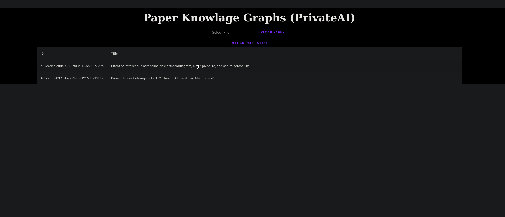

# Test assignment

## Summary

This repository is a test case for PrivateAI.
The repository is divided into 2 components backend (kg_back) and frontend (kg_front).

Backend implements extraction of knowledge graph from pdf, data storage and other necessary functions.
necessary functions.

## Demo



## Startup and installation

### Start kg_back

Dependency installation:

```sh
cd kg_back
python -m pip install -r requirements.txt
```

Before launching, make sure that the server is configured correctly in `kg_back/app-config.toml` file containing model settings, data storage path, etc.
Run the following command to start it:

```sh
cd kg_back
uvicorn main:app
```

### Start kg_front

Dependency installation:

```sh
cd kg_front
yarn install
```

Run the following command to start it:

```sh
cd kg_front
yarn run dev
```
